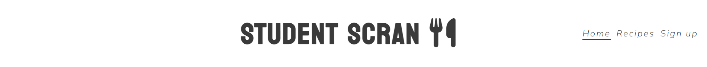
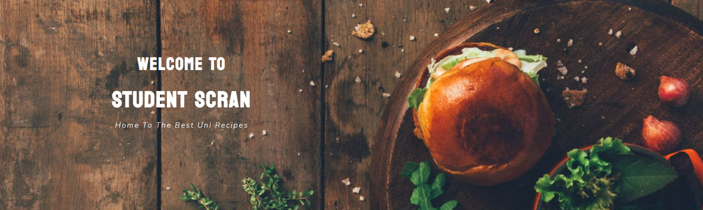
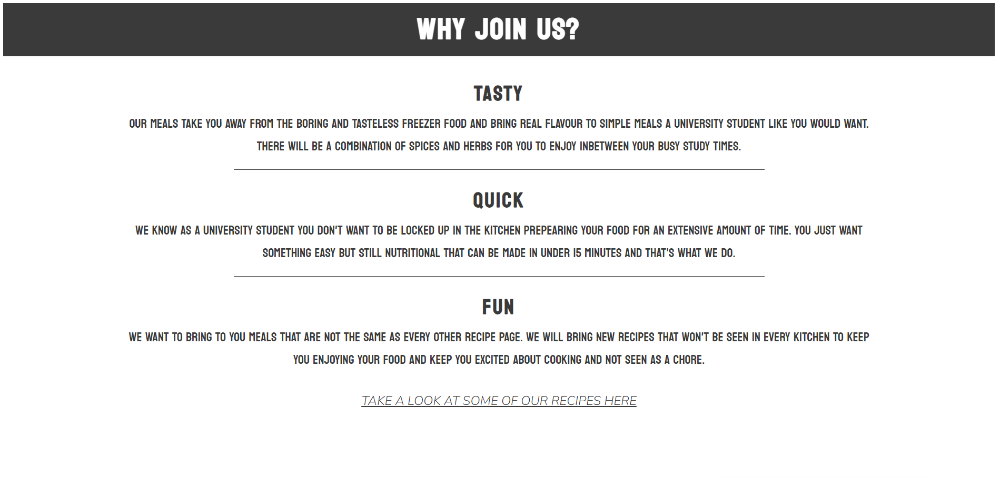
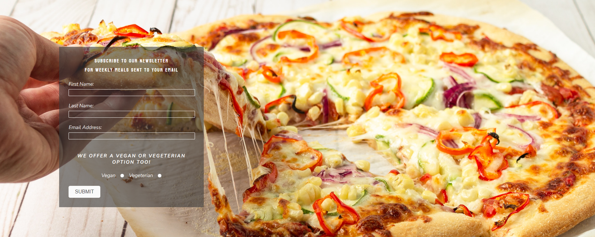
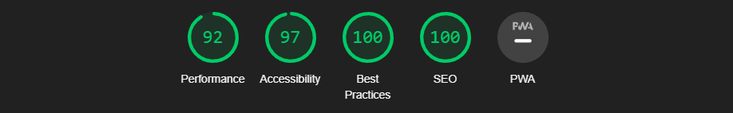

# Student Scran

The Student Scran webisite is a landing page designed for university students who are looking for easy, quick and tasty meals that they can cook from scratch on a low student budget. It offers many of recipes they can choose from and has weekly updates.

Users of this website will be able to easily access all the information required for them to find out how to sign up to the newsletter and get sent the weekly recipes.

<!--screenshot of website on different devices-->

# Features

### Navigation

   * At the top of the page in the center shows the website name: STUDENT SCRAN that links to the top of the page.
   * To the top right hand side of the page is the navigation menu links. These consits of: Home, Recipe and Sign Up which all link to different pages inside the website.
   * The navigation is in a font that can be differentiated from the the rest of the page so it easily stands out as a link.
   * The navigating link gives the user an easy indication of what the name of the website is and makes all pages easy to find and navigate.
 

### Header

   * The header welcomes the user to the page showing the name of the website clearly. Ive chosen the color white hre to give a good contrast to the background image.
   * The header explains the page is targeted to university students using a slogan.
   * This section tells the user what the page is about and who the intended audience is.
   

### Why Join Us Section

  * The Why Join Us section provides information to user on what the website provides.
  * This section provides the selling point on why they should join STUDENT SCRAN.
  * There is a link that takes the user to the recipe page at the bottom of the key points so we can keep them intrigue on what we offer.
  

### Footer

  * This section shows all the social media links the user can access to keep up to date with the student scran whereabouts.
  * There is 3 individual links each taking the user to a different social media of Student Scran.

  

### Recipe Section

  * This section provides examples to the user what they will experience once they sign up to the newsletter.
  * The recipe section has two full examples and three picture only meals to show a variety of what Student Scran can offer. 
  * This section is valuable to the user as it encourgaes them to sign up to obtain even more of these kinds of meals.

### Sign Up Section
  
  * The sign up section has a form to obtain information from the user so they can subscribe to weekly meals.
  * The form obtains the first name, last name, email address and whether they would like a vegan or a vegetarian option.
  * The sign up form is valuable to the user as it gives them the ability to subscribe to a weekly newsletter of new meals they can use.
  

## Testing

---

  * 1
  * 2
  * 3

### Bugs

  * 1
  * 2
  * 3

### Validator Testing

  * HTML
    * No errors were found when passing through the official W3C validator.
  
  * CSS 
    * No errors were found when passing through the official (Jigsaw) validator.

  * Accessibility
    * 1

### Unfixed Bugs

  * 1

# Deployment

  * The site was deployed to GitHub pages. The steps to deploy are as follows:
    * 1
    * 2

 
The live link can be found here - [Student Scran]()
 

# Credits

### Contents

 * The code to make the social media links was taken from the CI [love running](https://learn.codeinstitute.net/courses/course-v1:CodeInstitute+LR101+2021_T1/courseware/4a07c57382724cfda5834497317f24d5/e6d4cda2bc08458ba94d2092be9bad3a/) project.
 * The content in meal one instructions and ingredients was taken from [Delicious.](https://www.deliciousmagazine.co.uk/recipes/venison-meatballs-bean-slaw-and-flatbreads/)
 * The content in meal two instructions and ingredients was taken from [Delicious.](https://www.deliciousmagazine.co.uk/recipes/chilli-tomato-and-prawn-pasta/)
 * The icons in the footer and in the logo were taken from [Font Awesome](https://fontawesome.com/icons)

### Media

  * The image used on the home page was taken from [Pexels](https://www.pexels.com/photo/burger-and-vegetables-placed-on-brown-wood-surface-1565982/)
  * The image used for meal one was taken from [Unsplash](https://unsplash.com/photos/zPZ3n-2DwHo)
  * The image used for meal two was taken from [Unsplah](https://unsplash.com/photos/r01ZopTiEV8)
  * The images in the other meals section was taken from [Unsplah](https://unsplash.com/) 

